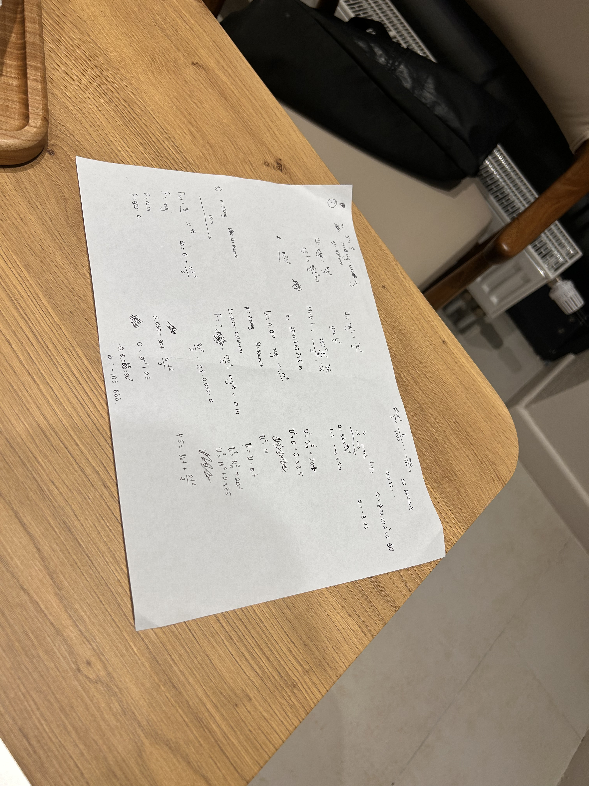
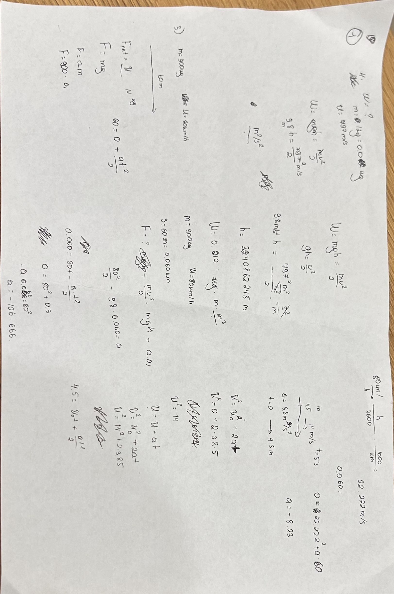
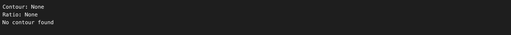

## OpenCV doc scanner
#### An interactive document scanner built in Python using OpenCV

The scanner takes images, find the corners of the document and applies the transformation to get a view of the document.

There are 4 ways used to find the corners and get a top-down view of a document:

    * Contour Detection
    * HoughLine Detection
    * GrabCut
    * Match points

Each of them find the corners differently. 

### Contour Detection
Using OpenCV built-in methods such as `cv2.findContours` and `cv2.Canny`, the process took little time to make this scanner part.

However the **Contour Detection** still faces some problems when the image has >1 rectangular shapes.

Example:

    With >1 rectangular shapes

