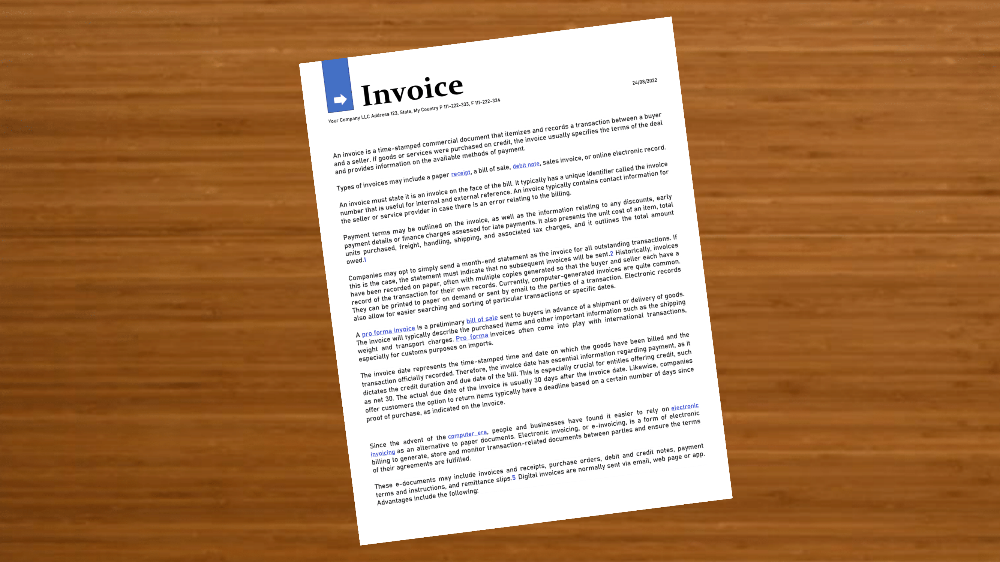
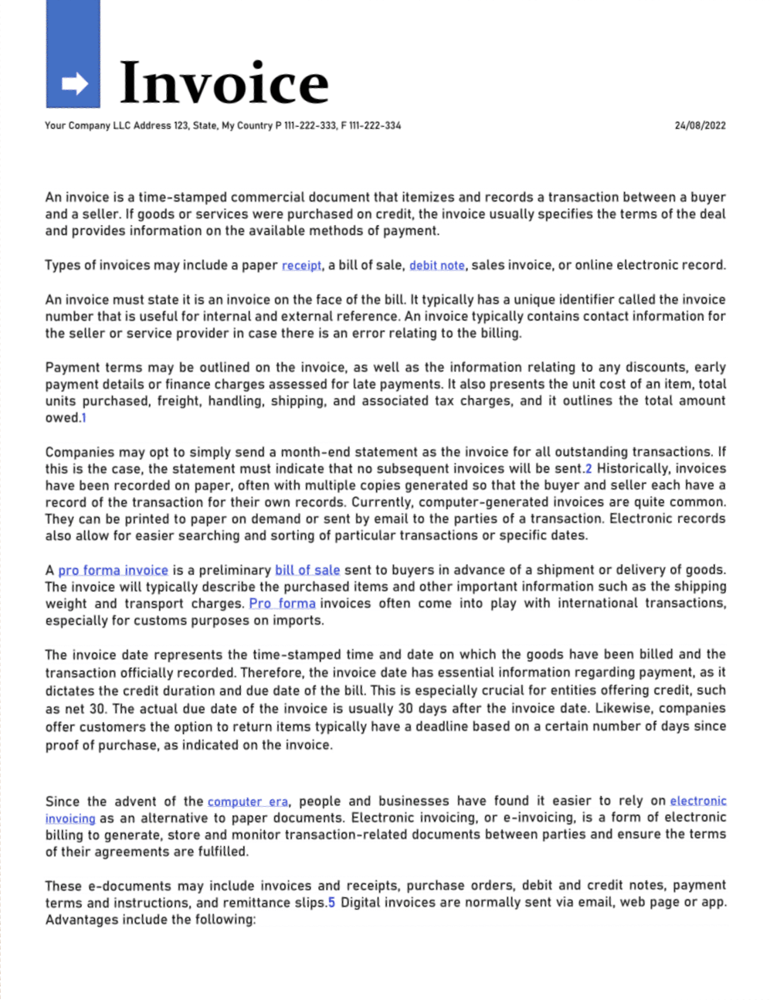

## OpenCV doc scanner
#### An interactive document scanner built in Python using OpenCV

The scanner takes images, find the corners of the document and applies the transformation to get a view of the document.

There are 4 ways used to find the corners and get a top-down view of a document:

    * Contour Detection
    * HoughLine Detection (not done yet...)
    * HSV Detection
    * GrabCut
    * Match points

Each of them find the corners differently. 

### Contour Detection
Using OpenCV built-in methods such as `cv2.findContours` and `cv2.Canny`, the process took little time to make this scanner part.

However the **Contour Detection** still faces some problems when the image has >1 rectangular shapes.

Example:

    With >1 rectangular shapes

### HSV Detection
Using OpenCV built-in `cv2.inRange()` and `cv2.cvtColor()` methods, we can produce the white-colored objects and extract the one with 4 contours, less than 90% of image, and more than 5% of image (to remove noises and board/table). 

Here is the results of previous image that Contour Detection struggled

### GrabCUT Detection
One of my favourites, does the 80-90% of the job, if hsv detection or contour detection fails. `cv2.grabcut()` does the job here (with some img preprocessing).

### Match Points Detection 
The last thing that does the job when every other detections fails. The user simply points the corners by themself. The most common and 100% working solution.

(No example here)

